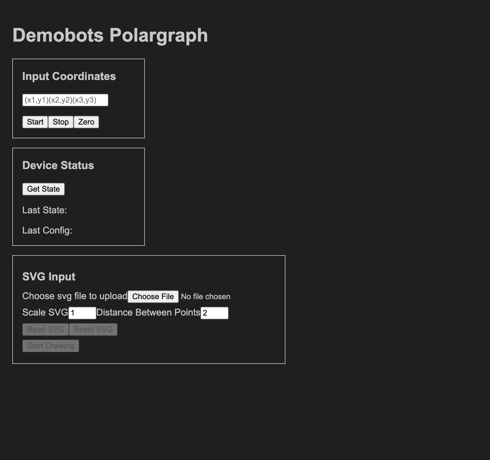

# Instructions for Demos
This guide will hopefully be able to cover everything you'd need to know for demos and SVG files, and will be updated as the project changes. Still, if you encounter any issues, don't hesitate to reach out to me on discord!
 
#####  - Jake (Demobots Head) 
##
 ## Setup and Inspection
In it's current state, Polargraph is a little heavy and very unwieldy and cumbersome to move around, so be careful and ask for help if you need it. Be sure to grab it's wooden laser-cut stand (better one coming in the future) from the RAS Office as well.

After you've propped it up securely, verify that the winches (black wheels attached the motors) don't have any of their tension string tangled around them. Unravel the power supply cord from Polargraph and set aside. 

Unscrew the backplate of the electrical harness to access the breadboard. (It may be off already)

**Verify that there are no loose connections and that** **everything is seated properly in the breadboard(s).** 

**When doing this, refer to the circuit diagrams, breadboard diagram, pinouts, etc.**

### Breadboard Diagram
Note that the MS1 and MS2 pins of each A4988 Stepper Driver are both 5V high, this sets the stepper motors to eighth step, refer to the [A4988 pinout](../Electrical/A4988_pinout.png) as needed.

The exact order of the stepper driver output wires depends on the stepper motor used, refer to the [A4988 pinout](../Electrical/A4988_pinout.png) as needed.
 

*Extra documentation can be found in [Electrical](../Electrical).*

Once you've double checked the connections, you can either rescrew the backplate or leave it open. Go ahead and plug in the power adapter to an AC wall outlet or extension cord.

You'll notice the ESP32's red light come on, along with a quiet but noticable noise coming from the stepper motors, if you don't, something is wrong. Unhook the tension wire from the paper clips and the top of the board, the motors should be locked, holding the gondola (marker holder) in place.

 *(Notice that when the Polargraph loses power, the steppers go limp and drop the gondola, we avoid that by placing the string of each winch hooked on the paper clip its next to.)*

 ## Optional - Changing Out Paper 
Get a piece/roll of large paper and cut it to your desired size, and either attach it to the board using the paperclips already on there, or by using tape. be sure to account for clearence with the winches when sizing your paper.

After you've attached the paper, either measure or guestimate the exact center of the page and mark it with a dot using the marker. There are guide arrows on the top and the left of the whiteboard that point to the center of the usable area.

Carefully and slowly, facing the board, manually adjust the winches (careful not to get anything tangled) such that the gondola's marker hole rest directly over the dot you marked. This is where we will tell Polargraph to set as the origin ("zero") of it's coordinate system. Double check that the gondola hole is exactly or as close as possible to the center.

Now place your marker ***(DRY ERASE ONLY)*** in the gondola, and secure it using the breadtie on there. the portion of marker sticking through the hole should be roughly the same length of the diameter of the castors on the gondola, the gondola should be resting on both the marker tip and the castors.

 ## Connecting
 On your device, be sure to have these instructions open/downloaded, as well as any SVG (Vector files) you'll want to upload to Polargraph to draw.

*The current Polargraph code can be finnicky about what SVG's it likes and which it doesn't like, so I've gone ahead and verified/prepared some good demonstration drawings:*

[Click here for working SVG files.](SVGs/WORKING)

On your device's wifi settings, disable any automatic reconnection to the ***utexas*** wifi (or other public access points), this helps to avoid accidental disconnections.

### Connect to the ESP32's access point using:

|SSID| Password |
|--|--|
|Demobot  | demobot1234  |

**When you're connected to Polargraph's access point, you won't have internet access! Be sure to have everything you need before connecting.**

 ### Once connected, in your web browser, go to [192.168.4.1](http://192.168.4.1/)
 
 
 ## Drawing

You should see a page that looks like this:

Click on the button marked `Zero` to set the current position as the origin of the graph.

Get a feel for the limits of the board, as the current code is weird and inconsistent. As of 02/25/23, the whiteboard attached is 35" by 24", with a usable area about half an inch less due to the tape. There also appears to be some sort of coded change to the Y-Max set in [polargraph.h](../PolargraphESP32/src/polargraph/polargraph.h) that cuts it down a bit. All four of the limits seem to get cut down by 10mm regardless.

This all translates to the rough limits of:

|X-Max| X-Min |Y-Max| Y-Min |
|--|--|--|--|
| 440 mm  | -440 mm  | (~) 300 mm| -340 mm|

### Points

You can input `(x,y)` coordinates you want the gondola to travel to in the text box at the top.

Press `Start` to start a movement. 

Press `Stop` to pause a movement.

To cancel a movement in progress, you will have to press `Stop` and reboot the ESP32 (Do this via pulling it's `GND` Jumper to avoid the gondola falling).

You can chain together multiple points in sequence like this: `(x1,y1)(x2,y2)(x3,y3)` 

(Remember that drawing straight lines is hard to do manually, as this uses a Bipolar coordinate system for the movement, so it makes arcs when traveling between points.) 

To return to the origin, dont press `Zero`! This isn't a 3D Printer, it doesn't have any position feedback. 
Simply type `(0,0)` into the text box and press `Start`.

### Uploading Vector Files (Drawings)

Before connecting to Polargraph, download the SVG files found [here](SVGs/WORKING).

Click the `Choose File` button on the webpage, and select the SVG file you want to draw.

Scale the SVG if needed [(see below)]((notes-on-svg-files)) in the `Scale SVG` box. This is a multiplier for the default size of the file, numbers greater than `1.0` will increase the size, to decrease the size of the image, input the scale as a decimal less than `1.0`. For example: for a 175% scale, type: `1.75`, for a for a 35% scale, type: `0.35`. (Negative values will flip the drawing, try to avoid that).

Don't worry about the `Distance Between Points` box, changing this number can break things, leave at `2`.

After you've chosen your file and scaled to your heart's desire, click  the `Read` button. 

This loads the drawing path, scroll down to see the preview windows, the top is the SVG, the bottom is the drawing path that Polargraph will take.

Click `Start Drawing` to start drawing! (who would've guessed?)

When you're down with that drawing, or want to have something new on the board, click `Reset SVG` or refresh the page. 

***Don't*** click `Read SVG` while you already have a SVG loaded in. Having more than one at a time can result in bad paths. 

See [Troubleshooting](troubleshooting) below if you're having issues.

# ---WIP PAST HERE---

### Notes On SVG Files

The vector to movement algohrithm is complicated, and to be honest, I'm no sure what file actually contains that code, So I've had to work out the following by trial and error:

- Only certain SVG's will work properly, they have to consist of vector paths only with a thickness of one pixel.
- Don't use any "image to vector" converters online, its best to trace out the path of the drawing you want using Inkscape or a similar program.
- Some of the 'Working' SVG files are still too big/small to be drawn properly in the current configuration. Use them based on the notes below:

### Working SVG Files

SVG's confirmed to work can be found [here](SVGs/WORKING)
________________________________________________________
[longhorn.svg](SVGs/WORKING/longhorn.svg)

- Best SVG we have so far
- Centered on origin well, but the drawing path starts at the tip of the right horn, so there will be an ugly travel line unless you tell it to move to that coordinate and erase the travel line before starting drawing. 
- It is fairly small by default, but not undrawable, you should be able to scale to 5ish at the most, experiment with it.
________________________________________________________
[creeper.svg](SVGs/WORKING/creeper.svg)

- About the same as longhorn.svg in terms of sizing and centering, ugly travel path is smaller.
- ***aww man***
________________________________________________________
[Spiral.svg](SVGs/WORKING/Spiral.svg)

- As you can see from the preview here it's centering is off by a lot, the whole spiral is drawn though, but (for some stupid reason I'm sure) the spiral is centered down and to the right when read into Polargraph.
- I wouldn't go above a 2x for this one, its fairly big as is.
________________________________________________________
[running-dog-silhouette.svg](SVGs/WORKING/running-dog-silhouette.svg)

- ***May be too big by default***, I haven't tested it in since implementing the currect conifugrations, play around with it. 
- Gets squished/squashed weird sometimes
________________________________________________________

(further working SVG files will have an entry here as well)
